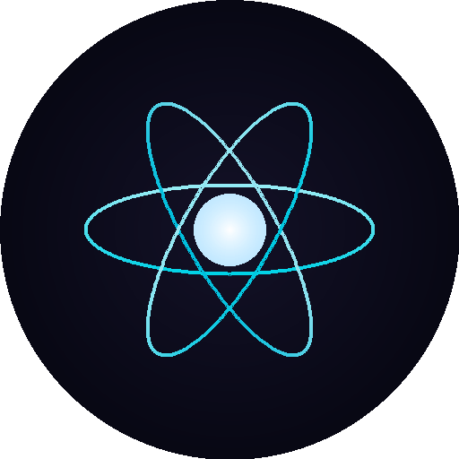
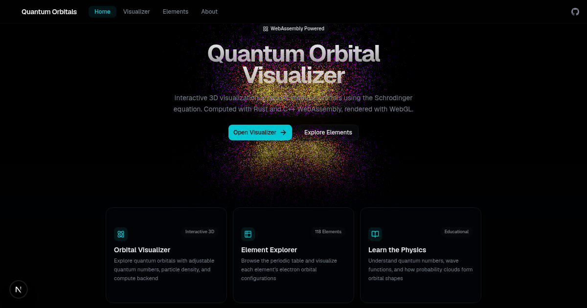
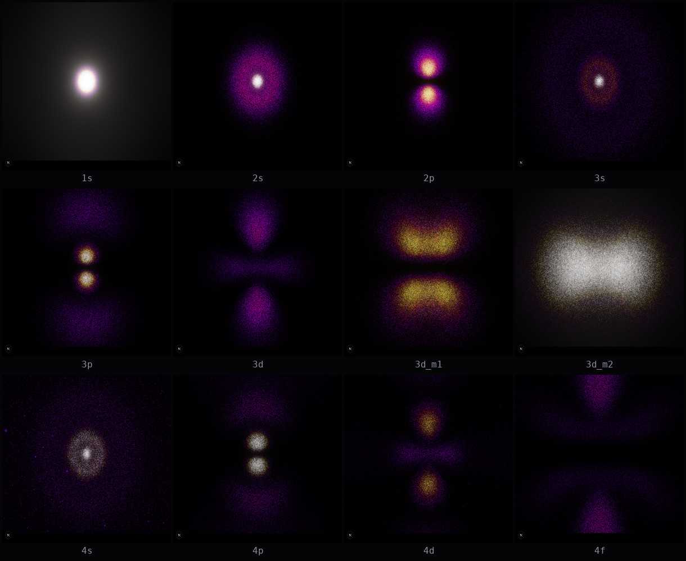

<p align="center">
  
</p>

<h1 align="center">Quantum Orbital Visualizer</h1>

<p align="center">
  Interactive 3D visualization of atomic electron orbitals powered by WebAssembly
</p>

<p align="center">
  <a href="https://atoms.thesatyajit.com"></a>
  
  
  
  
  
  
  
</p>

<p align="center">
  
</p>

---

Explore the quantum world through real-time particle simulations of hydrogen-like atomic orbitals. Each visualization represents the probability density |ψ|² of an electron's position, computed from the exact solutions to the Schrodinger equation and rendered as hundreds of thousands of glowing particles.

<p align="center">
  
</p>

## Features

**Orbital Visualizer** — Full interactive control over quantum numbers (n, l, m), particle count (10K-500K), point size, compute backend, and camera. Watch probability clouds morph in real time as you adjust parameters.

**Element Explorer** — Interactive periodic table with all 118 elements. Click any element to see its electron configuration parsed into individual orbitals, then visualize each one.

**Dual WASM Backends** — Switch between JavaScript, Rust WASM (~41KB), and C++23 WASM (~28KB) compute engines at runtime. Same physics, different implementations — useful for benchmarking and comparison.

**Physically Accurate** — Uses exact hydrogen atom wave functions: associated Laguerre polynomials for the radial part, associated Legendre polynomials for the angular part, and CDF inverse-transform sampling to generate particles that faithfully reproduce orbital shapes.

**Fire Heatmap Coloring** — Particles are colored based on local probability density: black → purple → red → orange → yellow → white. Higher density regions glow brighter with bloom post-processing.

**Responsive Design** — Works on desktop, tablet, and mobile. Controls adapt to screen size with a slide-up panel on small screens.

## How It Works

The hydrogen atom wave function in spherical coordinates:

```
ψ_nlm(r, θ, φ) = R_nl(r) × Y_lm(θ, φ)
```

1. **Build CDFs** — Compute cumulative distribution functions from the radial probability density `r²|R(r)|²` (4096 bins) and angular probability density `sin(θ)|Y(θ)|²` (2048 bins)
2. **Inverse-Transform Sample** — Draw uniform random numbers and map through the CDFs to get physically distributed (r, θ, φ) coordinates
3. **Color by Density** — Evaluate |ψ|² at each sample point and map to a fire heatmap color
4. **GPU Render** — Send positions and colors to WebGL as point particles with custom shaders, additive blending, and bloom post-processing

## Tech Stack

| Layer | Technology |
|-------|-----------|
| Framework | Next.js 16 (App Router, Turbopack) |
| UI | React 19, shadcn/ui, Tailwind CSS v4 |
| 3D | Three.js, react-three-fiber, @react-three/postprocessing |
| State | Zustand |
| Physics (Rust) | wasm-pack → WebAssembly (~41KB) |
| Physics (C++) | C++23, Emscripten → WebAssembly (~28KB) |
| Physics (JS) | TypeScript fallback engine |
| Fonts | Geist Sans & Mono |
| Testing | Vitest (24 tests), Playwright (visual) |

## Project Structure

```
atoms/
├── app/                    # Next.js pages (home, visualizer, elements, about)
├── components/
│   ├── controls/           # Quantum number, particle, engine controls
│   ├── layout/             # Header with responsive nav
│   ├── periodic-table/     # Interactive periodic table (118 elements)
│   ├── three/              # R3F scene, points, postprocessing, controls
│   └── ui/                 # shadcn/ui components
├── lib/
│   ├── chemistry/          # Electron config parser, quantum number utils
│   ├── data/               # Element data (118 elements)
│   ├── hooks/              # useOrbitalEngine, useOrbitalData
│   ├── stores/             # Zustand stores (visualizer, elements)
│   └── wasm/               # Engine interfaces, JS/Rust/C++ loaders
├── wasm/
│   ├── rust-orbital/       # Rust WASM source
│   └── cpp-orbital/        # C++23 WASM source (educational comments)
├── public/wasm/            # Compiled WASM binaries
├── scripts/                # Benchmark & visual test scripts
└── __tests__/              # Vitest unit tests
```

## Credits

Inspired by [kavan010/Atoms](https://github.com/kavan010/Atoms) — a C++ OpenGL desktop application for hydrogen quantum orbital visualization.

## License

MIT
